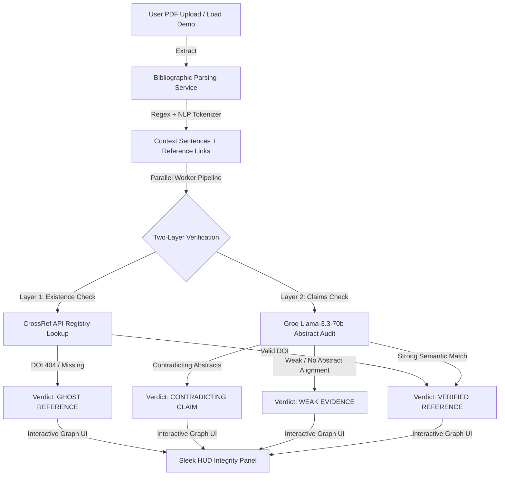

# 👻 CitationGhost — Academic Integrity Re-imagined

> **"CitationGhost verifies whether cited sources actually exist and genuinely support the claims made inside academic manuscripts."**
link to play : https://citationghost-wlnr.onrender.com/
[](http://localhost:8000/docs)
[](http://localhost:3000)
[](https://groq.com)

---

## 🔴 The Problem
As AI assistants are increasingly adopted to draft academic literature, a severe crisis has emerged: **citation fabrication (or "ghost references")**. 
1. **Hallucinated DOIs:** Large Language Models invent references that look completely legitimate, complete with authentic-looking authors, journal titles, and fake DOIs.
2. **Semantic Contradiction:** Even when cited papers actually exist, the original paper's abstract often **flatly contradicts or has zero evidence** for the claim made in the citing manuscript.

Peer reviewers spend hours manually looking up references, yet hundreds of papers with fabricated citations slip into publishing databases monthly.

---

## 🟢 The Solution: Two-Layer Citation Verification
CitationGhost is an **S-tier citation forensic suite** that deconstructs any academic manuscript in seconds to verify citation authenticity at two distinct levels:



### 🛡️ Layer 1: Existence & Registry Check
Every cited DOI is verified live against official registries (**CrossRef** and **Semantic Scholar** catalogs). If a DOI is missing, CitationGhost runs a bibliographic title search to catch manual typos, resolving whether the paper exists under a different identifier or is a total **Ghost Citation**.

### 🧠 Layer 2: LLM Claims Alignment
Once a paper is confirmed, CitationGhost fetches the official abstract and uses high-performance **Groq Llama-3.3-70B** models to perform a granular semantic comparison:
* Does the original text actually support the citing claim?
* Does it exaggerate the findings?
* Does it **flatly contradict** the claim?

---

## 🎨 Design Aesthetics & Visual Identity
CitationGhost is styled as a **high-fidelity security command terminal meets scholarly editor**:
* **Harmonious Palette:** Immersive ultra-dark backdrop (`#080810` / `#050816`) accented with vibrant, translucent colors: Rose Pink (`#FF2D6B` - warnings/errors), Cosmic Purple (`#7B2FBE` - machine learning), Coral Orange (`#FF6B35` - discrepancies), and Emerald Green (`#10B981` - verified assets).
* **Interactive SVG Network Map:** A responsive visual canvas displaying the citation topology. Clicking on any red/yellow node dynamically updates a sidebar HUD detailing the forensic discrepancy.
* **Canvas Wave Background:** Continuous quadratic Bezier curves drawn on a native Canvas, creating a premium fluid wave animation across the landing hero.
* **Glassmorphism:** Styled border panels using micro-opacities (`border-white/5` or `border-white/10`) with `backdrop-blur-md` for maximum layer depth.

---

## 🚀 30-Second Judge Money-Shot Demo
Pretend you are a hackathon judge. Here is the ultimate **2-minute test flow** with zero setup or code editing required:

1. **Enter the Workspace:** 
   * Click **Analyze a Paper** on the Landing Page.
2. **Trigger Instant Demo Mode:** 
   * Instead of finding a PDF, click the **"Load Demo"** button on the initiation workspace.
3. **Watch the Simulation:**
   * Watch the synchronized laser scanner sweep the viewport as the mock compiler terminal logs bibliographic extractions and API checks in real-time.
4. **Inspect the Contradictions:**
   * On the results dashboard, the bibliography is pre-filtered by **PROBLEMS ONLY** so you immediately see discrepancies.
   * Click on a red **"Ghost — DOI 404"** citation node on the interactive SVG graph.
5. **View Forensic Proof:**
   * Tap **"View Proof"** on the discrepancy list.
   * Reveal the side-by-side ledger highlighting: **"What you claimed"** vs. **"What the abstract actually says"**, punctuated by a clear contradiction warning.

---

## 🛠️ Technology Stack

| Layer | Technologies | Role |
| :--- | :--- | :--- |
| **Frontend** | React 19, Vite, TypeScript, Tailwind CSS, Motion, Lucide | Main interactive client dashboard |
| **Bridge/Proxy** | Express, Node.js, tsx | Secure file streaming & API routing coordinator |
| **Backend API** | Python, FastAPI, Uvicorn | Heavy parallel tasks, CORS headers, rate-limiting |
| **ML Engine** | Groq Llama-3.3-70b-versatile, Chroma DB | Inline claim parsing and abstract verification |
| **Academic Databases** | CrossRef Registry API, Semantic Scholar API | Real-time paper indexing & abstract lookup |

---

## 💿 Installation & Setup

### Prerequisites
* Node.js (v18+)
* Python (v3.10+)

### 1. Configure Credentials
Create a `.env` file in the root directory:
```env
PORT=3000
BACKEND_API_BASE_URL=http://localhost:8000/api
GROQ_API_KEY=your_groq_api_key_here
```

### 2. Start the Python API Backend
```bash
cd citationghost-backend
python -m venv venv
venv\Scripts\activate       # On Linux/macOS use: source venv/bin/activate
pip install -r requirements.txt
uvicorn main:app --reload --port 8000
```

### 3. Start the Frontend Dev Server
In a new terminal window at the repository root:
```bash
npm install
npm run dev
```
Open **`http://localhost:3000`** in your browser.

---

## 🔮 Future Roadmap
* **APA/IEEE Automated Correction:** Automatically rewrite citing sentences in real-time using context correctors to align exactly with resolved abstracts.
* **IPFS Decentralized Publishing:** Issue secure "Integrity Badges" on-chain, certifying that a manuscript's entire reference list has passed forensic validation.
* **Academic Word Add-in:** Bring the CitationGhost verification engine directly inside scholarly editors.
